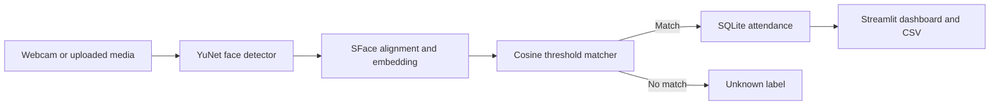

# FaceVision AI

**Face Recognition & Attendance Management System** built with Python, OpenCV, Streamlit, and SQLite. FaceVision AI detects faces, compares local face embeddings against enrolled users, distinguishes unknown people, and records recognized attendance with UTC timestamps.

> **Educational use only.** Face data is biometric data. Use consenting test participants, protect the local database, and read [Privacy Considerations](#privacy-considerations) before testing or deploying.

## Project Overview

Manual attendance is slow and difficult to reconcile. This project demonstrates an end-to-end computer-vision workflow: face enrollment, live or uploaded-media recognition, a duplicate-aware attendance ledger, and CSV export. It is structured as a portfolio application rather than a single-file demo.

## Problem Statement

Build a transparent prototype that can identify enrolled people from camera input, label non-matches as **Unknown**, and make attendance records reviewable and exportable, while minimizing retention of raw face imagery.

## Objectives

- Demonstrate face detection, embedding extraction, and threshold-based recognition.
- Enroll several face samples and retain only an averaged embedding.
- Record recognized check-ins with a configurable cooldown.
- Provide a dashboard, registration flow, live camera, uploaded-media demo, attendance ledger, and user deletion.
- Keep the default storage local and make privacy and model limitations visible.

## Features

- Streamlit dashboard with user, daily attendance, and record totals.
- Webcam enrollment that requires exactly one face per capture and combines three or more samples.
- Live browser-camera recognition through WebRTC, with boxes and recognized/unknown labels.
- Uploaded photo and short video recognition for hosted/demo use.
- Configurable cosine-similarity threshold and per-user attendance cooldown.
- SQLite user and attendance tables, CSV export, and cascading delete-user workflow.
- Automatic retrieval of public OpenCV Zoo model weights on first use; downloaded weights and biometric records are excluded from Git.
- No face image or embedding is sent to a third-party recognition API.

## System Architecture



The default database is `data/facevision.db`. Model files are downloaded to `models/`. Both paths can be changed with environment variables.

## Technologies

- Python 3.10-3.12
- Streamlit and `streamlit-webrtc`
- OpenCV contrib modules: YuNet face detection and SFace recognition
- NumPy for embedding operations
- SQLite for local user and attendance storage
- Pandas for dashboard tables and CSV-oriented presentation

## How Face Recognition Works

1. YuNet detects face boxes and five facial landmarks in each BGR frame.
2. OpenCV SFace aligns each detected face and generates its 128-value feature vector.
3. Registration captures at least three one-face samples, averages their vectors, normalizes the result, and stores that vector as JSON in SQLite. Captured sample images are not written to disk.
4. For each live face, the app computes cosine similarity against registered vectors. The highest score is a match only when it meets `FACEVISION_MATCH_THRESHOLD`; otherwise the face is labeled **Unknown**.
5. A recognized person is recorded only when no attendance row falls within `FACEVISION_COOLDOWN_SECONDS`.

The default threshold is `0.42`, a deliberately conservative starting point relative to common SFace cosine examples. It is not a universal accuracy guarantee. Evaluate false acceptance and false rejection on representative consenting data before relying on any threshold. The threshold is adjustable because camera, pose, lighting, and population affect similarity scores.

## Installation

Install Python 3.10, 3.11, or 3.12 and ensure `python` is on your PATH. Open a terminal in the project root.

### Windows PowerShell

```powershell
py -3.10 -m venv .venv
.\.venv\Scripts\python.exe -m pip install --upgrade pip
.\.venv\Scripts\python.exe -m pip install -r requirements.txt
```

If PowerShell blocks virtual-environment activation, these commands do not require activation. On macOS/Linux, create the environment with `python3 -m venv .venv`, then use `.venv/bin/python -m pip install --upgrade pip` and `.venv/bin/python -m pip install -r requirements.txt`.

The YuNet and SFace ONNX files are downloaded from the OpenCV Zoo repository the first time the registration or recognition workflow needs them. Internet access is required for that first use. Model files are intentionally not checked into this repository.

## Run the Application

From the project root:

```powershell
python -m streamlit run app.py
```

Open the local URL printed by Streamlit, normally `http://localhost:8501`. Allow camera access in your browser when using registration or live recognition. If your browser or host cannot provide WebRTC camera access, use **Live recognition → Upload image or video** instead. Video demo processing samples every twelfth frame and analyzes at most 90 frames.

## Configuration

Configuration is optional. Set environment variables before launching Streamlit:

| Variable | Default | Purpose |
| --- | --- | --- |
| `FACEVISION_DB_PATH` | `data/facevision.db` | SQLite database path |
| `FACEVISION_DATA_DIR` | `data/` | Default data directory used by the database path |
| `FACEVISION_MODELS_DIR` | `models/` | Downloaded ONNX model directory |
| `FACEVISION_MATCH_THRESHOLD` | `0.42` | Cosine match threshold, greater than 0 and at most 1 |
| `FACEVISION_COOLDOWN_SECONDS` | `3600` | Minimum seconds between attendance records for one person |

For example, in PowerShell: `$env:FACEVISION_MATCH_THRESHOLD = "0.45"`. Keep biometric files and environment-specific configuration out of version control.

## Project Structure

```text
Face Recognition & Attendance Management System/
├── app.py
├── requirements.txt
├── README.md
├── .gitignore
├── .env.example
├── LICENSE
├── src/
│   ├── __init__.py
│   ├── attendance.py
│   ├── database.py
│   ├── face_detection.py
│   ├── face_recognition.py
│   └── utils.py
├── data/.gitkeep
├── models/.gitkeep
├── assets/screenshots/.gitkeep
└── tests/
    ├── test_database.py
    └── test_recognition.py
```

## Database Design

SQLite initializes its schema at startup.

| Table | Important columns | Purpose |
| --- | --- | --- |
| `users` | `user_id` (primary key), `display_name`, `embedding`, `created_at` | One normalized SFace template per registered ID |
| `attendance` | `id`, `user_id` (foreign key), `timestamp`, `recognition_status` | Recognized check-ins; deleting a user cascades to their attendance history |

Times are stored in UTC ISO-8601 format. The CSV export includes user ID, display name, timestamp, and recognition status. SQLite does not encrypt the embedding column; secure the database file and its backups at the operating-system level.

## Screenshots

Add genuine screenshots to `assets/screenshots/` after running the app. Do not include real people, personal information, or biometric database/model files in screenshots or commits.

<!-- Example after adding safe screenshots:


-->

## Sample Workflow

1. Open **Register user**, enter a unique ID and display name, and capture three or more samples with exactly one face visible each time.
2. Open **Live recognition** and start the browser camera, or use a consenting test photo/video in upload mode.
3. Confirm enrolled people are labeled by name and unmatched faces are labeled **Unknown**.
4. Open **Attendance** to review records and download the CSV.
5. Delete a user from the same page when their data should be removed; deletion also removes linked attendance history.

## Testing

Run the automated tests from the project root:

```powershell
python -m unittest discover -s tests -v
```

Tests cover database initialization, registration, invalid and duplicate IDs, attendance insertion and cooldown, CSV export, cascading deletion, recognized embeddings, and below-threshold unknown results. Camera, model-download, and end-to-end recognition behavior require a camera or representative test media and are not simulated by the automated suite.

## Limitations

- No liveness or anti-spoofing checks; a photo or screen may fool the prototype.
- Lighting, pose, occlusion, image quality, and demographic variation can affect results.
- Similarity thresholds require validation for each deployment context; false matches and missed matches remain possible.
- This project is not suitable for high-stakes decisions, access control, employment decisions, or production attendance without a security, privacy, fairness, and legal review.
- SQLite is appropriate for a local single-instance prototype, not a horizontally scaled multi-user service.
- Hosted free tiers may have ephemeral disks, constrained CPU, blocked camera/WebRTC paths, and no durable attendance storage.

## Privacy Considerations

- The default local workflow keeps the SQLite database on the machine running the app. Model weights are public application files and contain no enrolled-person data.
- Raw enrollment captures and camera frames are processed in memory and are not intentionally persisted. Streamlit/WebRTC transport still sends browser camera frames to the machine/server running the app.
- Face embeddings are biometric identifiers. They are stored unencrypted in SQLite by default; restrict file and backup access. Deleting a user removes that template and associated attendance rows, but cannot remove copies from backups.
- When deployed to a hosted service, uploaded media and WebRTC frames reach that host. The host operator controls the runtime, and its filesystem may be ephemeral. Never use real biometric data on a public demo without informed consent, a retention and deletion policy, access controls, and legal approval.
- Do not commit the database, model weights, captured images, real attendance exports, or identifying screenshots. Check `.gitignore` and inspect staged files before every push.
- This project makes no claim of legal compliance or biometric accuracy.

## Deployment

### Streamlit Community Cloud

1. Push this repository to GitHub with no database, face media, model weights, or secrets included.
2. In Streamlit Community Cloud, create an app from the repository, set the main file to `app.py`, and deploy. `requirements.txt` is at the repository root.
3. The app downloads the OpenCV Zoo models on first recognition use. The hosted demo is best treated as an uploaded-media demonstration; browser WebRTC camera access can depend on host/network ICE and TURN support.
4. Community Cloud local storage may reset, and a SQLite file is not a durable shared database. Do not treat hosted attendance as permanent records. Use consenting, non-sensitive demo media only.

### Local Webcam vs. Hosted Demo

Run `python -m streamlit run app.py` on a computer with a webcam for local enrollment and real-time camera recognition. On a hosted deployment, use **Upload image or video** if browser camera transport is blocked. Uploaded media is still sent to and processed by the hosting service; this mode is not a privacy-preserving substitute for local processing.

## GitHub

Before publishing, replace the author placeholder below, review `.gitignore`, and inspect what will be committed:

```powershell
git init
git add .
git status --short
git diff --cached --stat
git commit -m "Build FaceVision AI attendance application"
git branch -M main
git remote add origin https://github.com/<your-username>/facevision-ai.git
git push -u origin main
```

Suggested commit messages for incremental development:

- `chore: scaffold Streamlit project and dependencies`
- `feat: add SQLite enrollment and attendance repository`
- `feat: add YuNet detection and SFace recognition pipeline`
- `feat: build dashboard registration and live recognition views`
- `test: cover enrollment cooldown and CSV export`
- `docs: explain setup privacy and deployment workflow`

## Future Enhancements

- Add optional at-rest database encryption with managed key handling.
- Add explicit retention controls, consent records, and audit logging.
- Evaluate liveness detection and bias/accuracy metrics on properly governed datasets.
- Add administrator authentication and a durable database for controlled deployments.
- Add configurable local timezone reporting and richer attendance summaries.

